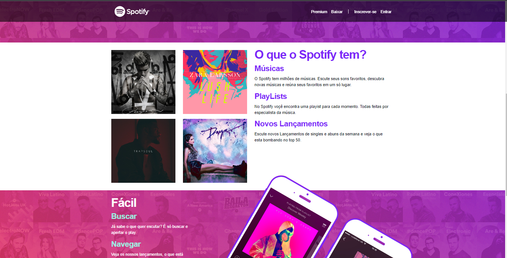

# Projeto-replica-spotify
<h1 align="center"> Site Spotify </h1>

Projeto exclusivo, realizado no curso de Desenvolvimento WEB.

  <a href="#-tecnologias">Tecnologias</a>&nbsp;&nbsp;&nbsp;|&nbsp;&nbsp;&nbsp;
  <a href="#-projeto">Projeto</a>&nbsp;&nbsp;&nbsp;|&nbsp;&nbsp;&nbsp;
  <a href="#memo-licença">Licença</a>

  

 

  

/
## 🚀 Tecnologias

Esse projeto foi desenvolvido com as seguintes tecnologias:

- HTML e CSS
- bootstrap
- javascript
- JQuery
- Git e Github

## 💻 Projeto

O Site replica do spotify é um projeto realizado para pratica de Html5, css, javascript, jquery e bootstrap.

## :memo: Licença

Esse projeto está sob a licença MIT.

---

Feito por israelamarante.